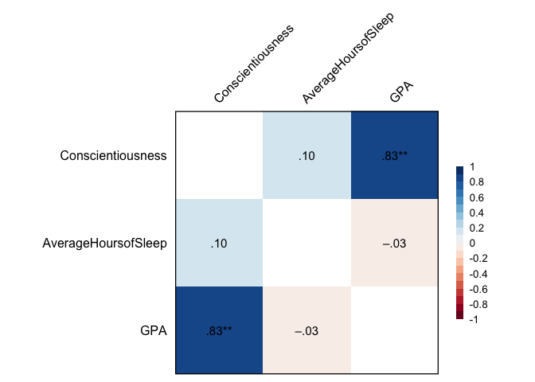
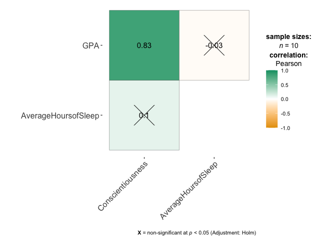
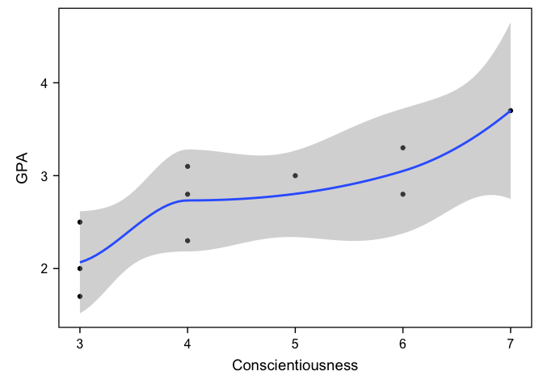
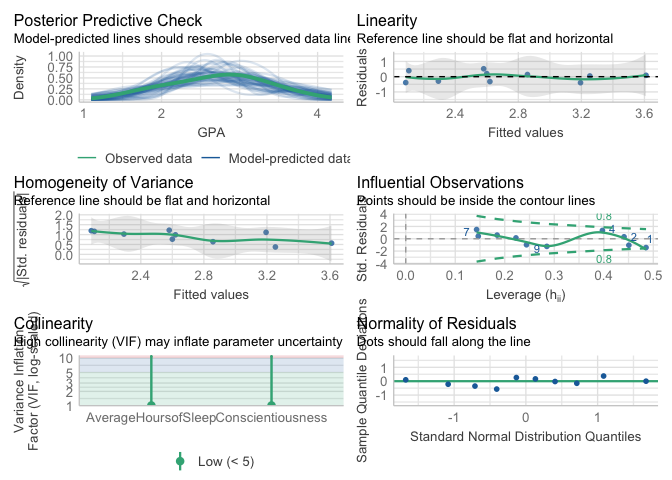
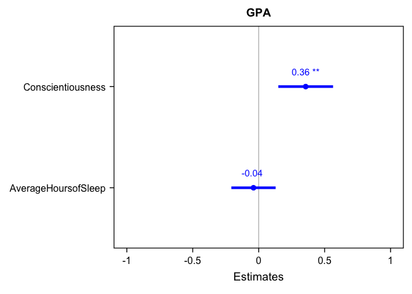
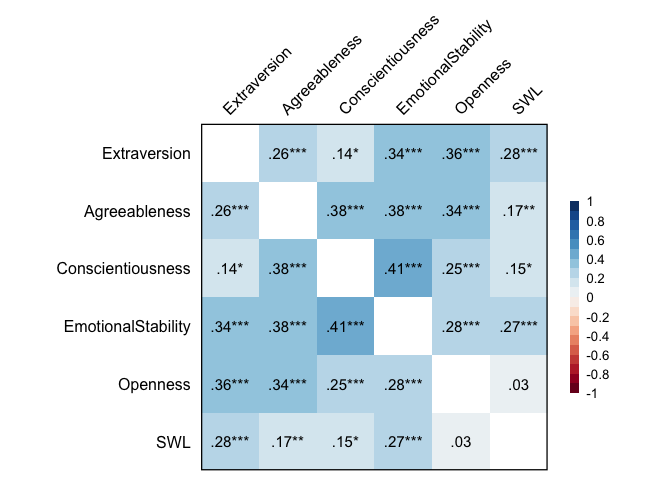
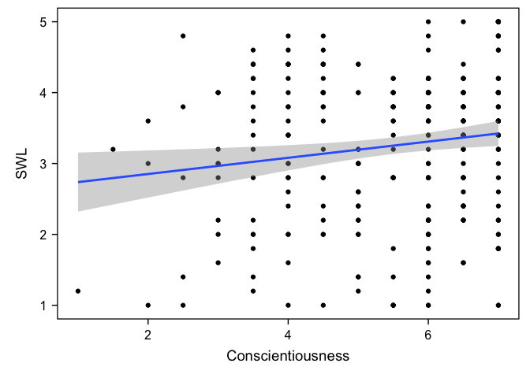
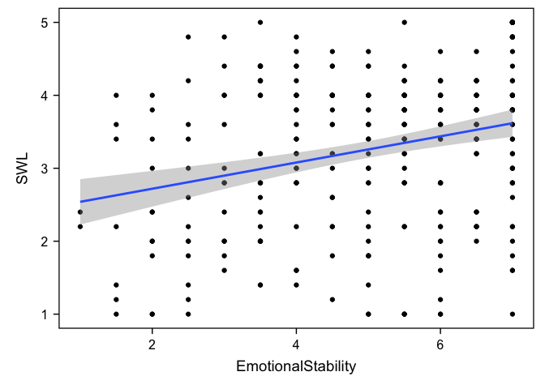
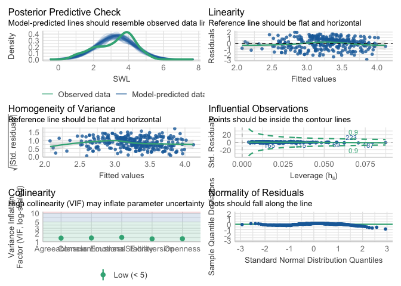
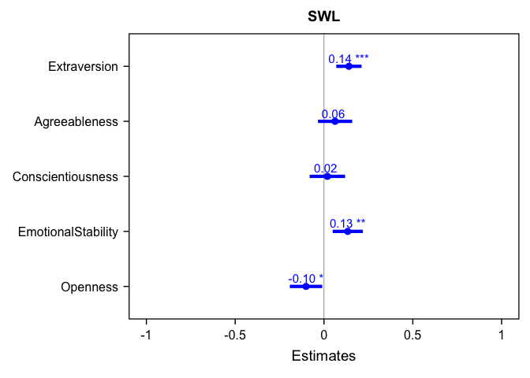

Lab7
================
Mursal Jahed
2024-10-17

# Load packages and dataset

``` r
library(haven)
library(bruceR)
```

    ## Warning: package 'bruceR' was built under R version 4.3.3

    ## 
    ## bruceR (v2024.6)
    ## Broadly Useful Convenient and Efficient R functions
    ## 
    ## Packages also loaded:
    ## ✔ data.table ✔ emmeans
    ## ✔ dplyr      ✔ lmerTest
    ## ✔ tidyr      ✔ effectsize
    ## ✔ stringr    ✔ performance
    ## ✔ ggplot2    ✔ interactions
    ## 
    ## Main functions of `bruceR`:
    ## cc()             Describe()  TTEST()
    ## add()            Freq()      MANOVA()
    ## .mean()          Corr()      EMMEANS()
    ## set.wd()         Alpha()     PROCESS()
    ## import()         EFA()       model_summary()
    ## print_table()    CFA()       lavaan_summary()
    ## 
    ## For full functionality, please install all dependencies:
    ## install.packages("bruceR", dep=TRUE)
    ## 
    ## Online documentation:
    ## https://psychbruce.github.io/bruceR
    ## 
    ## To use this package in publications, please cite:
    ## Bao, H.-W.-S. (2024). bruceR: Broadly useful convenient and efficient R functions (Version 2024.6) [Computer software]. https://CRAN.R-project.org/package=bruceR

    ## 
    ## These packages are dependencies of `bruceR` but not installed:
    ## - pacman, openxlsx, ggtext, vars, phia, MuMIn, GGally
    ## 
    ## ***** Install all dependencies *****
    ## install.packages("bruceR", dep=TRUE)

``` r
library(dplyr)
library(ggstatsplot)
```

    ## You can cite this package as:
    ##      Patil, I. (2021). Visualizations with statistical details: The 'ggstatsplot' approach.
    ##      Journal of Open Source Software, 6(61), 3167, doi:10.21105/joss.03167

``` r
library(performance)
library(sjPlot)
```

    ## Warning: package 'sjPlot' was built under R version 4.3.3

``` r
ex <- read_sav("/Users/mursal_j/Documents/GitHub/Lab7/ex.sav")

lab7<-read.csv("/Users/mursal_j/Documents/GitHub/Lab7/lab7.csv")
```

# Correlation

``` r
#First, you will need to select variables or composites of interest

ex <- ex %>%
  select(Conscientiousness, AverageHoursofSleep, GPA)

#The Corr function also gives you a correlation plot between all variables, but it doesn't look pretty enough and not very customizable

Corr(ex)
```

    ## Pearson's r and 95% confidence intervals:
    ## ───────────────────────────────────────────────────────────────────────
    ##                                            r      [95% CI]     p      N
    ## ───────────────────────────────────────────────────────────────────────
    ## Conscientiousness-AverageHoursofSleep   0.10 [-0.56, 0.69]  .775     10
    ## Conscientiousness-GPA                   0.83 [ 0.42, 0.96]  .003 **  10
    ## AverageHoursofSleep-GPA                -0.03 [-0.65, 0.61]  .939     10
    ## ───────────────────────────────────────────────────────────────────────

<!-- -->

    ## Correlation matrix is displayed in the RStudio `Plots` Pane.

``` r
#If you hate the correlation plot design, you can use the following function
ggcorrmat(ex)
```

<!-- -->

``` r
#If you want to visualize the correlation between two specifcic variables, you can use the following code
ggplot(ex, aes(x = Conscientiousness, y = GPA)) + geom_point() + geom_smooth() + theme_bruce()
```

    ## `geom_smooth()` using method = 'loess' and formula = 'y ~ x'

    ## Warning in simpleLoess(y, x, w, span, degree = degree, parametric = parametric,
    ## : pseudoinverse used at 2.98

    ## Warning in simpleLoess(y, x, w, span, degree = degree, parametric = parametric,
    ## : neighborhood radius 2.02

    ## Warning in simpleLoess(y, x, w, span, degree = degree, parametric = parametric,
    ## : reciprocal condition number 8.9711e-17

    ## Warning in simpleLoess(y, x, w, span, degree = degree, parametric = parametric,
    ## : There are other near singularities as well. 1

    ## Warning in predLoess(object$y, object$x, newx = if (is.null(newdata)) object$x
    ## else if (is.data.frame(newdata))
    ## as.matrix(model.frame(delete.response(terms(object)), : pseudoinverse used at
    ## 2.98

    ## Warning in predLoess(object$y, object$x, newx = if (is.null(newdata)) object$x
    ## else if (is.data.frame(newdata))
    ## as.matrix(model.frame(delete.response(terms(object)), : neighborhood radius
    ## 2.02

    ## Warning in predLoess(object$y, object$x, newx = if (is.null(newdata)) object$x
    ## else if (is.data.frame(newdata))
    ## as.matrix(model.frame(delete.response(terms(object)), : reciprocal condition
    ## number 8.9711e-17

    ## Warning in predLoess(object$y, object$x, newx = if (is.null(newdata)) object$x
    ## else if (is.data.frame(newdata))
    ## as.matrix(model.frame(delete.response(terms(object)), : There are other near
    ## singularities as well. 1

<!-- -->

``` r
#Note that the line will naturally follow the data points, but you can specify to plot the fittest line by adding method = lm to the geom_smooth() function
ggplot(ex, aes(x = Conscientiousness, y = GPA)) + geom_point() + geom_smooth(method = lm) + theme_bruce()
```

    ## `geom_smooth()` using formula = 'y ~ x'

<!-- -->

# Regression

``` r
#step 1: build a model
model<-lm(GPA ~ Conscientiousness + AverageHoursofSleep, data = ex)
#lm = linear model, ~ means GPA predicted by variable after
#Have to build the model first before checking for assumptions
#step 2: check the assumptions
check_model(model)
```

<!-- -->

``` r
#step 3: summarize results; add ,std = TRUE if you want to get standardized coefficients
model_summary(model)
```

    ## 
    ## Model Summary
    ## 
    ## ──────────────────────────────
    ##                      (1) GPA  
    ## ──────────────────────────────
    ## (Intercept)           1.431   
    ##                      (0.667)  
    ## Conscientiousness     0.356 **
    ##                      (0.088)  
    ## AverageHoursofSleep  -0.039   
    ##                      (0.071)  
    ## ──────────────────────────────
    ## R^2                   0.702   
    ## Adj. R^2              0.617   
    ## Num. obs.            10       
    ## ──────────────────────────────
    ## Note. * p < .05, ** p < .01, *** p < .001.
    ## 
    ## # Check for Multicollinearity
    ## 
    ## Low Correlation
    ## 
    ##                 Term  VIF       VIF 95% CI Increased SE Tolerance
    ##    Conscientiousness 1.01 [1.00, 2.49e+11]         1.01      0.99
    ##  AverageHoursofSleep 1.01 [1.00, 2.49e+11]         1.01      0.99
    ##  Tolerance 95% CI
    ##      [0.00, 1.00]
    ##      [0.00, 1.00]

``` r
# or using the tab_model functionl; add  ,show.std = TRUE if you want to get standardized coefficients
tab_model(model)
```

<table style="border-collapse:collapse; border:none;">
<tr>
<th style="border-top: double; text-align:center; font-style:normal; font-weight:bold; padding:0.2cm;  text-align:left; ">
 
</th>
<th colspan="3" style="border-top: double; text-align:center; font-style:normal; font-weight:bold; padding:0.2cm; ">
GPA
</th>
</tr>
<tr>
<td style=" text-align:center; border-bottom:1px solid; font-style:italic; font-weight:normal;  text-align:left; ">
Predictors
</td>
<td style=" text-align:center; border-bottom:1px solid; font-style:italic; font-weight:normal;  ">
Estimates
</td>
<td style=" text-align:center; border-bottom:1px solid; font-style:italic; font-weight:normal;  ">
CI
</td>
<td style=" text-align:center; border-bottom:1px solid; font-style:italic; font-weight:normal;  ">
p
</td>
</tr>
<tr>
<td style=" padding:0.2cm; text-align:left; vertical-align:top; text-align:left; ">
(Intercept)
</td>
<td style=" padding:0.2cm; text-align:left; vertical-align:top; text-align:center;  ">
1.43
</td>
<td style=" padding:0.2cm; text-align:left; vertical-align:top; text-align:center;  ">
-0.15 – 3.01
</td>
<td style=" padding:0.2cm; text-align:left; vertical-align:top; text-align:center;  ">
0.069
</td>
</tr>
<tr>
<td style=" padding:0.2cm; text-align:left; vertical-align:top; text-align:left; ">
Conscientiousness
</td>
<td style=" padding:0.2cm; text-align:left; vertical-align:top; text-align:center;  ">
0.36
</td>
<td style=" padding:0.2cm; text-align:left; vertical-align:top; text-align:center;  ">
0.15 – 0.56
</td>
<td style=" padding:0.2cm; text-align:left; vertical-align:top; text-align:center;  ">
<strong>0.005</strong>
</td>
</tr>
<tr>
<td style=" padding:0.2cm; text-align:left; vertical-align:top; text-align:left; ">
AverageHoursofSleep
</td>
<td style=" padding:0.2cm; text-align:left; vertical-align:top; text-align:center;  ">
-0.04
</td>
<td style=" padding:0.2cm; text-align:left; vertical-align:top; text-align:center;  ">
-0.21 – 0.13
</td>
<td style=" padding:0.2cm; text-align:left; vertical-align:top; text-align:center;  ">
0.596
</td>
</tr>
<tr>
<td style=" padding:0.2cm; text-align:left; vertical-align:top; text-align:left; padding-top:0.1cm; padding-bottom:0.1cm; border-top:1px solid;">
Observations
</td>
<td style=" padding:0.2cm; text-align:left; vertical-align:top; padding-top:0.1cm; padding-bottom:0.1cm; text-align:left; border-top:1px solid;" colspan="3">
10
</td>
</tr>
<tr>
<td style=" padding:0.2cm; text-align:left; vertical-align:top; text-align:left; padding-top:0.1cm; padding-bottom:0.1cm;">
R<sup>2</sup> / R<sup>2</sup> adjusted
</td>
<td style=" padding:0.2cm; text-align:left; vertical-align:top; padding-top:0.1cm; padding-bottom:0.1cm; text-align:left;" colspan="3">
0.702 / 0.617
</td>
</tr>
</table>

``` r
#step 4: plot the results; change type ="est" to type = "std" if you want to plot the standardized coefficients
plot_model(model,  type ="est",  show.values = TRUE, vline.color = "#1B191999", line.size = 1.5, dot.size = 2.5, colors = "blue") + theme_bruce()
```

<!-- -->

``` r
#posterior predictor check is about bayesian, irrelevant to us, influential observations is about outliers and we can also not really look at that, COLLINEARITY IS MOST IMPORTANT
#tabmodels shows up on side
```

# Q1: Use the Corr or the ggcorrmat function to plot the correlation between all variables. Which personality traits are correlated with satisfaction with life and which one is not?

``` r
#Don't use select function because there are no participant IDs in these data sets, only data points.
Corr(lab7)
```

    ## Pearson's r and 95% confidence intervals:
    ## ──────────────────────────────────────────────────────────────────────
    ##                                          r      [95% CI]     p       N
    ## ──────────────────────────────────────────────────────────────────────
    ## Extraversion-Agreeableness            0.26 [ 0.15, 0.36] <.001 *** 298
    ## Extraversion-Conscientiousness        0.14 [ 0.03, 0.25]  .014 *   299
    ## Extraversion-EmotionalStability       0.34 [ 0.24, 0.44] <.001 *** 297
    ## Extraversion-Openness                 0.36 [ 0.26, 0.46] <.001 *** 297
    ## Extraversion-SWL                      0.28 [ 0.18, 0.38] <.001 *** 299
    ## Agreeableness-Conscientiousness       0.38 [ 0.28, 0.48] <.001 *** 299
    ## Agreeableness-EmotionalStability      0.38 [ 0.28, 0.47] <.001 *** 297
    ## Agreeableness-Openness                0.34 [ 0.24, 0.44] <.001 *** 297
    ## Agreeableness-SWL                     0.17 [ 0.06, 0.28]  .003 **  299
    ## Conscientiousness-EmotionalStability  0.41 [ 0.31, 0.50] <.001 *** 298
    ## Conscientiousness-Openness            0.25 [ 0.14, 0.36] <.001 *** 298
    ## Conscientiousness-SWL                 0.15 [ 0.03, 0.25]  .012 *   300
    ## EmotionalStability-Openness           0.28 [ 0.17, 0.38] <.001 *** 296
    ## EmotionalStability-SWL                0.27 [ 0.16, 0.37] <.001 *** 298
    ## Openness-SWL                          0.03 [-0.08, 0.14]  .591     298
    ## ──────────────────────────────────────────────────────────────────────

<!-- -->

    ## Correlation matrix is displayed in the RStudio `Plots` Pane.

``` r
ggcorrmat(lab7)
```

<!-- -->

``` r
ggplot(lab7, aes(x = Extraversion, y = SWL)) + geom_point() + geom_smooth(method = lm) + theme_bruce()
```

    ## `geom_smooth()` using formula = 'y ~ x'

    ## Warning: Removed 1 row containing non-finite outside the scale range
    ## (`stat_smooth()`).

    ## Warning: Removed 1 row containing missing values or values outside the scale range
    ## (`geom_point()`).

<!-- -->

``` r
ggplot(lab7, aes(x = Agreeableness, y = SWL)) + geom_point() + geom_smooth(method = lm) + theme_bruce()
```

    ## `geom_smooth()` using formula = 'y ~ x'

    ## Warning: Removed 1 row containing non-finite outside the scale range (`stat_smooth()`).
    ## Removed 1 row containing missing values or values outside the scale range
    ## (`geom_point()`).

<!-- -->

``` r
ggplot(lab7, aes(x = Conscientiousness, y = SWL)) + geom_point() + geom_smooth(method = lm) + theme_bruce()
```

    ## `geom_smooth()` using formula = 'y ~ x'

<!-- -->

``` r
ggplot(lab7, aes(x = EmotionalStability, y = SWL)) + geom_point() + geom_smooth(method = lm) + theme_bruce()
```

    ## `geom_smooth()` using formula = 'y ~ x'

    ## Warning: Removed 2 rows containing non-finite outside the scale range
    ## (`stat_smooth()`).

    ## Warning: Removed 2 rows containing missing values or values outside the scale range
    ## (`geom_point()`).

<!-- -->

``` r
ggplot(lab7, aes(x = Openness, y = SWL)) + geom_point() + geom_smooth(method = lm) + theme_bruce()
```

    ## `geom_smooth()` using formula = 'y ~ x'

    ## Warning: Removed 2 rows containing non-finite outside the scale range (`stat_smooth()`).
    ## Removed 2 rows containing missing values or values outside the scale range
    ## (`geom_point()`).

<!-- -->

``` r
#Response: All Big5 personality traits except for openness were positively correlated with satisfaction with life. This means that as the expression of that personality trait increases, the satisfaction with life of the individual with that trait also increases. The reverse is true. 
```

# Q2: Run a multiple regression using the Big 5 personality traits to predict satisfaction with life and plot the results

``` r
#for this lab assignment you would assume assumptions are met, but for your own analysis, you will need to examine assumptions carefully
#step 1: build a model
model<-lm(SWL ~ Extraversion + Agreeableness + Conscientiousness + EmotionalStability + Openness, data = lab7)
#lm = linear model, ~ means GPA predicted by variable after
#Have to build the model first before checking for assumptions
#step 2: check the assumptions
check_model(model)
```

<!-- -->

``` r
#step 3: summarize results; add ,std = TRUE if you want to get standardized coefficients
model_summary(model)
```

    ## 
    ## Model Summary
    ## 
    ## ───────────────────────────────
    ##                     (1) SWL    
    ## ───────────────────────────────
    ## (Intercept)           2.191 ***
    ##                      (0.308)   
    ## Extraversion          0.140 ***
    ##                      (0.036)   
    ## Agreeableness         0.062    
    ##                      (0.049)   
    ## Conscientiousness     0.019    
    ##                      (0.051)   
    ## EmotionalStability    0.134 ** 
    ##                      (0.043)   
    ## Openness             -0.101 *  
    ##                      (0.046)   
    ## ───────────────────────────────
    ## R^2                   0.138    
    ## Adj. R^2              0.123    
    ## Num. obs.           294        
    ## ───────────────────────────────
    ## Note. * p < .05, ** p < .01, *** p < .001.
    ## 
    ## # Check for Multicollinearity
    ## 
    ## Low Correlation
    ## 
    ##                Term  VIF   VIF 95% CI Increased SE Tolerance Tolerance 95% CI
    ##        Extraversion 1.26 [1.14, 1.50]         1.12      0.79     [0.67, 0.88]
    ##       Agreeableness 1.34 [1.20, 1.59]         1.16      0.75     [0.63, 0.83]
    ##   Conscientiousness 1.36 [1.21, 1.61]         1.16      0.74     [0.62, 0.83]
    ##  EmotionalStability 1.42 [1.26, 1.68]         1.19      0.70     [0.59, 0.79]
    ##            Openness 1.28 [1.15, 1.52]         1.13      0.78     [0.66, 0.87]

``` r
# or using the tab_model functionl; add  ,show.std = TRUE if you want to get standardized coefficients
tab_model(model)
```

<table style="border-collapse:collapse; border:none;">
<tr>
<th style="border-top: double; text-align:center; font-style:normal; font-weight:bold; padding:0.2cm;  text-align:left; ">
 
</th>
<th colspan="3" style="border-top: double; text-align:center; font-style:normal; font-weight:bold; padding:0.2cm; ">
SWL
</th>
</tr>
<tr>
<td style=" text-align:center; border-bottom:1px solid; font-style:italic; font-weight:normal;  text-align:left; ">
Predictors
</td>
<td style=" text-align:center; border-bottom:1px solid; font-style:italic; font-weight:normal;  ">
Estimates
</td>
<td style=" text-align:center; border-bottom:1px solid; font-style:italic; font-weight:normal;  ">
CI
</td>
<td style=" text-align:center; border-bottom:1px solid; font-style:italic; font-weight:normal;  ">
p
</td>
</tr>
<tr>
<td style=" padding:0.2cm; text-align:left; vertical-align:top; text-align:left; ">
(Intercept)
</td>
<td style=" padding:0.2cm; text-align:left; vertical-align:top; text-align:center;  ">
2.19
</td>
<td style=" padding:0.2cm; text-align:left; vertical-align:top; text-align:center;  ">
1.58 – 2.80
</td>
<td style=" padding:0.2cm; text-align:left; vertical-align:top; text-align:center;  ">
<strong>\<0.001</strong>
</td>
</tr>
<tr>
<td style=" padding:0.2cm; text-align:left; vertical-align:top; text-align:left; ">
Extraversion
</td>
<td style=" padding:0.2cm; text-align:left; vertical-align:top; text-align:center;  ">
0.14
</td>
<td style=" padding:0.2cm; text-align:left; vertical-align:top; text-align:center;  ">
0.07 – 0.21
</td>
<td style=" padding:0.2cm; text-align:left; vertical-align:top; text-align:center;  ">
<strong>\<0.001</strong>
</td>
</tr>
<tr>
<td style=" padding:0.2cm; text-align:left; vertical-align:top; text-align:left; ">
Agreeableness
</td>
<td style=" padding:0.2cm; text-align:left; vertical-align:top; text-align:center;  ">
0.06
</td>
<td style=" padding:0.2cm; text-align:left; vertical-align:top; text-align:center;  ">
-0.03 – 0.16
</td>
<td style=" padding:0.2cm; text-align:left; vertical-align:top; text-align:center;  ">
0.204
</td>
</tr>
<tr>
<td style=" padding:0.2cm; text-align:left; vertical-align:top; text-align:left; ">
Conscientiousness
</td>
<td style=" padding:0.2cm; text-align:left; vertical-align:top; text-align:center;  ">
0.02
</td>
<td style=" padding:0.2cm; text-align:left; vertical-align:top; text-align:center;  ">
-0.08 – 0.12
</td>
<td style=" padding:0.2cm; text-align:left; vertical-align:top; text-align:center;  ">
0.710
</td>
</tr>
<tr>
<td style=" padding:0.2cm; text-align:left; vertical-align:top; text-align:left; ">
EmotionalStability
</td>
<td style=" padding:0.2cm; text-align:left; vertical-align:top; text-align:center;  ">
0.13
</td>
<td style=" padding:0.2cm; text-align:left; vertical-align:top; text-align:center;  ">
0.05 – 0.22
</td>
<td style=" padding:0.2cm; text-align:left; vertical-align:top; text-align:center;  ">
<strong>0.002</strong>
</td>
</tr>
<tr>
<td style=" padding:0.2cm; text-align:left; vertical-align:top; text-align:left; ">
Openness
</td>
<td style=" padding:0.2cm; text-align:left; vertical-align:top; text-align:center;  ">
-0.10
</td>
<td style=" padding:0.2cm; text-align:left; vertical-align:top; text-align:center;  ">
-0.19 – -0.01
</td>
<td style=" padding:0.2cm; text-align:left; vertical-align:top; text-align:center;  ">
<strong>0.030</strong>
</td>
</tr>
<tr>
<td style=" padding:0.2cm; text-align:left; vertical-align:top; text-align:left; padding-top:0.1cm; padding-bottom:0.1cm; border-top:1px solid;">
Observations
</td>
<td style=" padding:0.2cm; text-align:left; vertical-align:top; padding-top:0.1cm; padding-bottom:0.1cm; text-align:left; border-top:1px solid;" colspan="3">
294
</td>
</tr>
<tr>
<td style=" padding:0.2cm; text-align:left; vertical-align:top; text-align:left; padding-top:0.1cm; padding-bottom:0.1cm;">
R<sup>2</sup> / R<sup>2</sup> adjusted
</td>
<td style=" padding:0.2cm; text-align:left; vertical-align:top; padding-top:0.1cm; padding-bottom:0.1cm; text-align:left;" colspan="3">
0.138 / 0.123
</td>
</tr>
</table>

``` r
#step 4: plot the results; change type ="est" to type = "std" if you want to plot the standardized coefficients
plot_model(model,  type ="est",  show.values = TRUE, vline.color = "#1B191999", line.size = 1.5, dot.size = 2.5, colors = "blue") + theme_bruce()
```

<!-- -->

# Q3: Interpret the R2. Which personality trait(s) can explain unique variance in satisfaction with life when controlling for each other, and which ones cannot? If someone asks you for advice on how to improve life satisfaction, based on your results, which personality trait would you recommend them to change and why?

\#Response: The R2 value means that 13.8% of the variance in
satisfaction with life is explained by the Big5 personality traits. The
personality traits that can explain unique variance are extraversion,
emotional stability and openness as they are significant in this model.
This means that if someone asks to improve their life satisfaction,
these would be the personality traits I would recommend them to work
with as they best predict satisfaction with life. For example, I would
recommend them to increase their extraversion and emotional stability,
and decrease openness.
